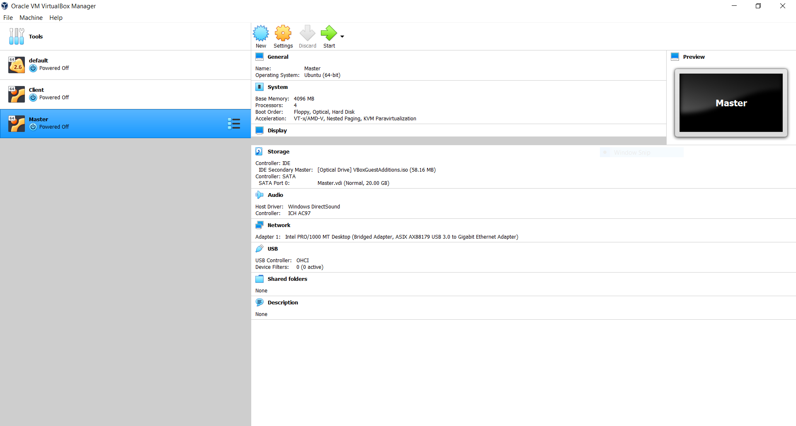
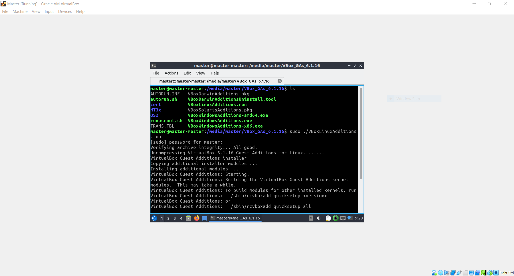
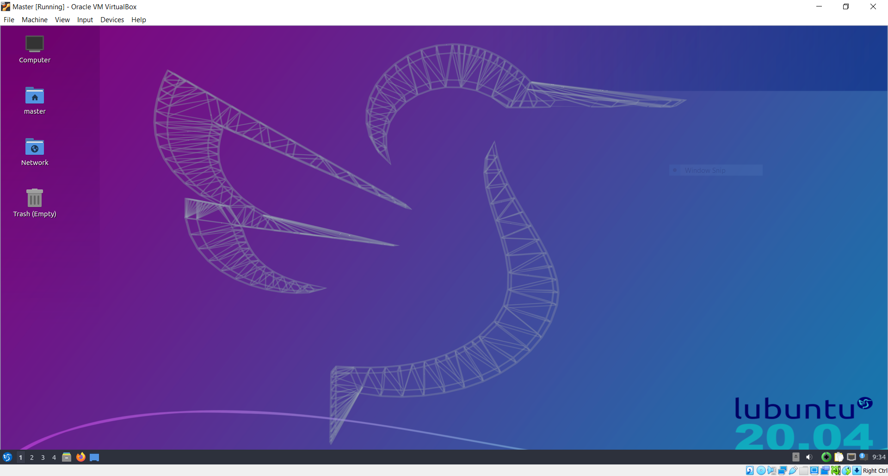
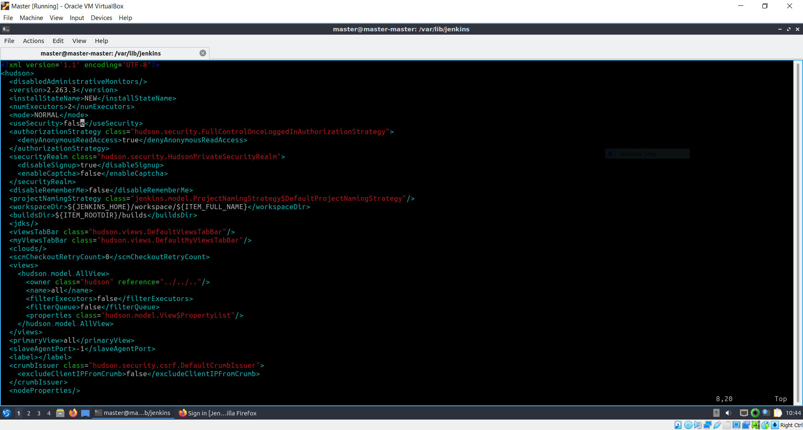
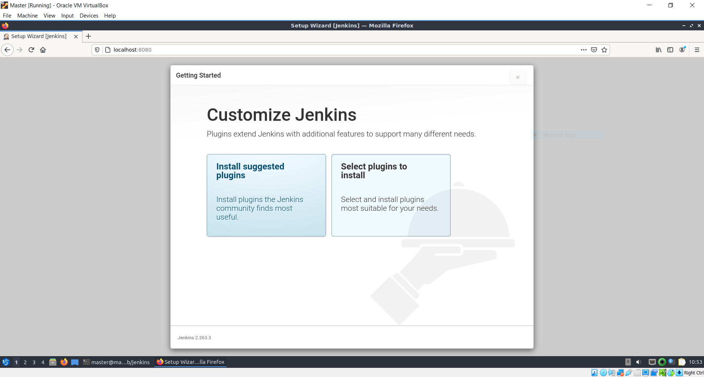
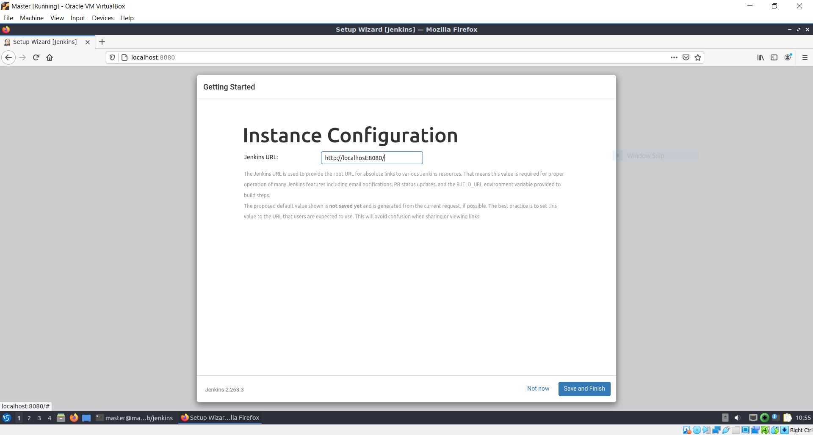

# Git, Ansible, Jenkins, Docker, Kubernetes DevOps Pipeline #


## 1. Create New VirtualBox Virtual Machines (VMs) ##

Create a Master VM and any number of Client VMs.



Mount VirtualBox Guest Additions by clicking on the following tab on your VMs:

```
Devices/Insert Guest Additions CD image
```

In the new pop-up window, browse your host file system for the VBoxGuestAdditions.iso file then click ```Add```.

Install the mounted VirtualBox Guest Additions by going to the directory:
 ```/media/VM-Name-Here/VBox_GAs_Version-Here``` 

Ensure you replace "*VM-Name-Here*" with the name of your VM and "*Version-Here*" with your version of Guest Additions CD image in the directory above. Example: ```/media/master/VBox_GAs_6.1.16```

Run the ```VBoxLinuxAdditions.run``` file using the following command:

    sudo ./VBoxLinuxAdditions.run




Click the following tab on your VMs:

```
View/Adjust Window Size
```

Maximize, or scale, your VM window(s).



(Optional) Enable bi-directional copy and paste use clipboard between host machine and VMs. Click the following tab on your VMs:

```
Devices/Shared Clipboard/Bidirectional
```

Ensure you are running an up-to-date Operating System (OS). If you are not, follow the on-screen updates/upgrades.


## 2. Install Jenkins ##

### A. Install Java: ###

Install OpenJDK 8 on your Master VM by running the following command:

    sudo apt-get install openjdk-8-jdk

### B. Install Docker: ###

Install Docker on your Master VM. Ensure you are following the most up-to-date documentation: [https://docs.docker.com/engine/install/](https://docs.docker.com/engine/install/)

Installation requires you to run the following commands on your Master VM:

    sudo apt remove docker docker-engine docker.io containerd runc
    sudo apt update
    sudo apt install \
    apt-transport-https \
    ca-certificates \
    curl \
    gnupg-agent \
    software-properties-common
    curl -fsSL https://download.docker.com/linux/ubuntu/gpg | sudo apt-key add -
    sudo apt-key fingerprint 0EBFCD88
    sudo add-apt-repository \
       "deb [arch=amd64] https://download.docker.com/linux/ubuntu \
       $(lsb_release -cs) \
       stable"
    sudo apt update
    sudo apt install docker-ce docker-ce-cli containerd.io

### C. Install Jenkins: ###

Install Jenkins on your Master VM. Ensure you are following the most up-to-date documentation: [https://www.jenkins.io/doc/book/installing/](https://www.jenkins.io/doc/book/installing/)

Installation requires you to run the following commands on your Master VM:


    wget -q -O - https://pkg.jenkins.io/debian-stable/jenkins.io.key | sudo apt-key add -
    sudo sh -c 'echo deb https://pkg.jenkins.io/debian-stable binary/ > \
    /etc/apt/sources.list.d/jenkins.list'
    sudo apt update
    sudo apt install jenkins

### D. Modify config.xml: ###

Modify ```/var/lib/jenkins/config.xml``` and edit ```<useSecurity>true</useSecurity>``` to
```<useSecurity>false</useSecurity>```



Restart Jenkins:

    sudo systemctl restart jenkins

### E. Install Plugins: ###

In your Master VM, open a new tab in a web-browser and open ```http://localhost:8080/```.

NOTE: Port 8080 is the default port for Jenkins. Ensure no other application is accessing Port 8080.

Once Jenkins loads, click ```Install Suggested Plugins```




After all suggested plugins are downloaded successfully, configure Jenkins URL to ```http://localhost:8080/``` and click ```Save and Finish```.



Once Jenkins opens the Dashboard, click ```Manage Jenkins/Manage Plugins/Available`` and search for the following:

1. Python
2. ShiningPanda
3. Docker
4. Docker Pipeline
5. CloudBees Docker Custom Build Environment
6. Ansible

Ensure you have selected all plugins then click ```Download now and install after restart```


When all plugins have been downloaded successfully, click ```Restart Jenkins when installation is complete and no jobs are running``` then click ```Go back to the top page```


### F. Add Docker Credentials ###

Click on ```Manage Jenkins/Manage Credentials/Jenkins/Global credentials (unrestricted)/Add Credentials```

For Kind, select ```Username with Password```

Type in your DockerHUB ```Username``` and ```Password```

For ID, type ```dockerhub```

Click ```OK```

NOTE: Never check sensitive material into source control!


### G. Add Ansible Credentials ###

Click on ```Manage Jenkins/Manage Credentials/Jenkins/Global credentials (unrestricted)/Add Credentials```

For ```Kind```, select ```SSH Username with private key```

For ```ID```, type ```ansible```

For ```Username```, type ```master```

NOTE: Replace ```master``` with your username which currently exists on the Master VM host.

For ```Private Key```, click ```Enter directly```

Run the following command in your Master VM:

    cat ~/.ssh/id_rsa

Click ```Key``` and copy the output from the previous command in the box given to you that says ```Enter New Secret Below```

Click ```OK```

NOTE: Never check sensitive material into source control!


## 3. Create a Jenkins Pipeline ##

Go back to the Jenkins Dashboard and click ```New Item / Pipeline``` and give it a name. Then click ```OK```


Under the General Tab, click ```GitHub Project``` and add your ```Project url```


Under **Build Triggers**, click ```Poll SCM``` and set the Schedule as you'd like. To check SCM every minute, type ```* * * * *```

Under **Pipeline**, select ```Pipeline script from SCM``` for ```Definition```
Select ```Git``` for ```SCM```
Add your Repository URL

Change ```Branches to build``` to ```*/main```

For ```Additional Behaviors``` click ```Add``` and select ```Clean before checkout```. Click ```Delete untracked nested repositories```


At the bottom of the page, click ```Apply```. Shortly after, click ```Save```.


## 4. Install Ansible ##

Install Ansible on your Master VM. Ensure you are following the most up-to-date documentation: [https://docs.ansible.com/ansible/latest/installation_guide/intro_installation.html](https://docs.ansible.com/ansible/latest/installation_guide/intro_installation.html)

Installation requires you to run the  following commands on your Master VM:


    sudo apt update
    sudo apt install software-properties-common
    sudo apt-add-repository --yes --update ppa:ansible/ansible
    sudo apt install ansible


### A. Modify hosts files: ###

Obtain the IP Address(es) of your Client VM(s). Add the IP Address(es) to both of the following hosts files:


- /etc/hosts
- /etc/ansible/hosts


NOTE: The Ansible hosts file is called the Inventory.

### B. Configure SSH: ###

Install openssh-server on Client VM:
```
sudo apt install openssh-server
```

Generate a new SSH Key and copy the public key to your Client VM:

    ssh-keygen
    ssh-copy-id client@client-client


NOTE: Replace ```client@client-client``` with your username and host. In the command above, the right-side of @ is the host, or IP Address. The left-side of @ is the username which currently exists on the host.

### C. Allow Passwordless Sudo: ###
Execute the following command in your Client VM in order to modify the ```sudoers``` file safely:

    sudo visudo

Add the following line at the bottom of the ```sudoers``` file:

    client ALL=(ALL:ALL) NOPASSWD: ALL

NOTE: Replace ```client``` with the username which currently exists on the host.


## 5. Install Kubernetes ##


Install Kubernetes on your Client VM(s). Ensure you are following the most up-to-date documentation: [https://docs.ansible.com/ansible/latest/installation_guide/intro_installation.html](https://docs.ansible.com/ansible/latest/installation_guide/intro_installation.html)

Or use the provided ```playbook-install-kubernetes.yaml```. It requires you to run following command on your Master VM:

    ansible-playbook playbook-install-kubernetes.yaml


## 6. Make a Change to SCM

Modify the project however you like on ```SCM``` using ```git```.

NOTE: Master and Client VMs must be running. Also, Master VM must be running Jenkins with Poll SCM configured.

In your Master VM, open a new tab in a web-browser and open ```http://http://192.168.49.2:32500/``` to view the change when the pipeline is done.

NOTE: Replace ```192.168.49.2``` with your Client VM's IP Address. Replace ```32500``` with your application's service's nodePort.

## Useful Resources ##
To help you configure ```Docker```, ```Ansible``` and ```Jenkins``` commands in ```Jenkinsfile```, visit the following URL in your Master VM while Jenkins is running:

> http://localhost:8080/job/git-jenkins-ansible-vb-docker-k8/pipeline-syntax/

---
Challenges:

- Docker & Kubernetes Installation in Playbook
- Escape every (') with (\) inside multi-line sh (''') in Jenkinsfile
- Clone/Pull repo in Playbook